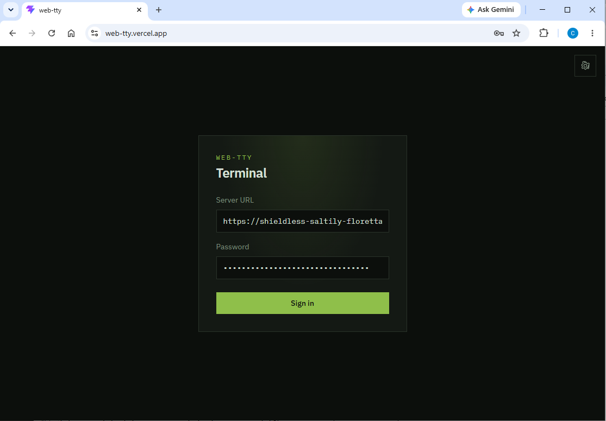
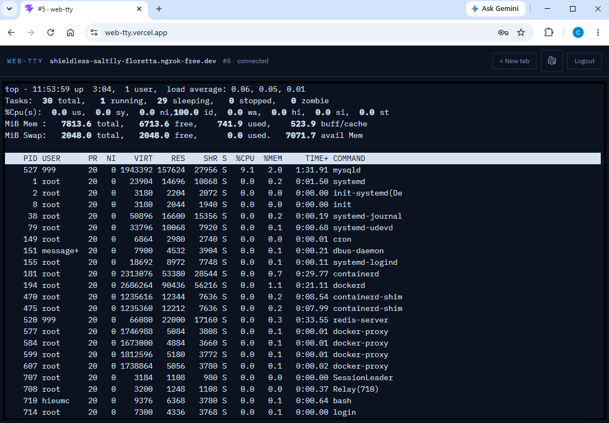
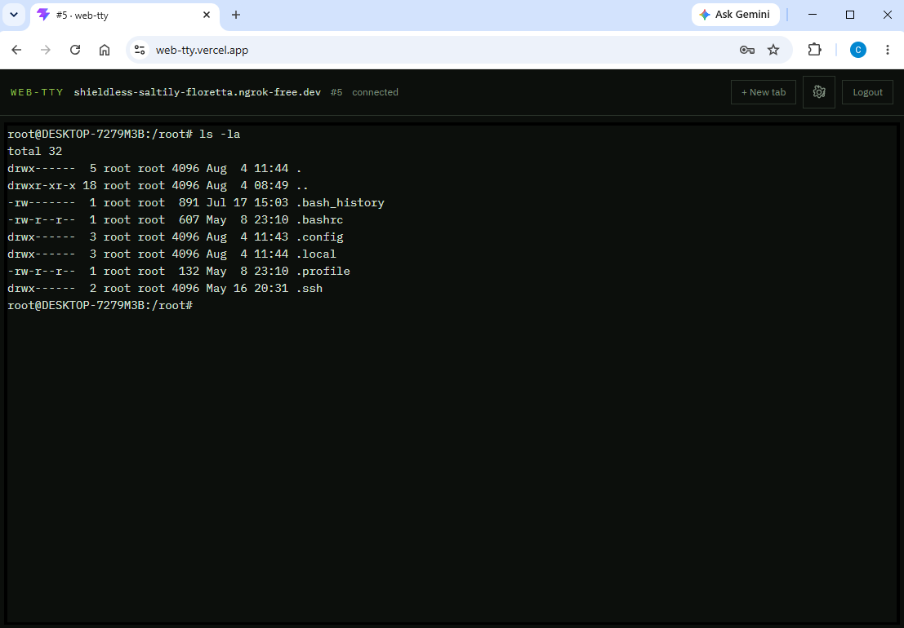

# web-tty

**Your Linux shell, in the browser.**

A personal web terminal for one private server. Install the agent once, open the hosted UI, and get a full interactive shell — `vim`, `htop`, `docker logs -f`, and everything else that works in a real PTY.

No WebSocket. No SSH. Just HTTP.

## Try it

1. **Install the server** on a Linux x86_64 host (see below).
2. **Expose it over HTTPS** — nginx, Cloudflare Tunnel, ngrok, or similar.
3. Open the hosted UI: **[https://web-tty.vercel.app](https://web-tty.vercel.app)**
4. Enter your **Server URL** and **password**, then sign in.

Each browser tab gets its own terminal. Themes are available from the settings gear.

## Install

Requires Linux **x86_64** (Debian/Ubuntu with systemd). The installer downloads the binary from [GitHub Releases](https://github.com/conghieu120/web-tty/releases) and registers a systemd service:

```bash
curl -fsSL https://raw.githubusercontent.com/conghieu120/web-tty/master/install.sh -o install.sh
sudo bash install.sh
```

You’ll be prompted for `AUTH_PASSWORD` and a few options (secrets can be auto-generated).

Useful commands after install:

```bash
systemctl status web-tty
journalctl -u web-tty -f
```

Or grab the binary yourself from [Releases](https://github.com/conghieu120/web-tty/releases) if you prefer a manual setup.

<p align="center">
  
</p>

<p align="center">
  
</p>

<p align="center">
  
</p>

## Why web-tty

- Real PTY — interactive apps just work
- Password-protected, session cookies
- Multi-tab sessions
- Built-in themes (Moss, Midnight, and more)
- HTTP-only — easy behind reverse proxies and tunnels
- Hosted UI — no need to build or host the frontend yourself

## Development

For local hacking (optional):

```bash
# server — Linux / WSL
cd server && cp .env.example .env && go run .

# client
cd client && npm install && npm run dev
```

## License

Private / personal use.
